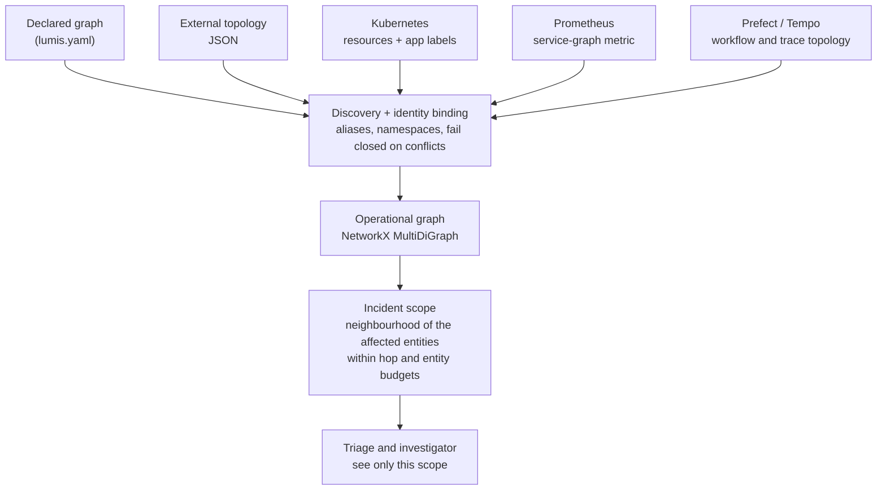

# Operational graph and lineage

The “NX” in the design means **NetworkX** (`import networkx as nx`), not the Nx JavaScript
monorepo tool. NetworkX is now a core Python dependency. Pydantic validates portable graph
contracts; a NetworkX `MultiDiGraph` powers traversal and export. No Neo4j, graph server,
Graphviz or plotting package is required.

[NetworkX MultiDiGraph](https://networkx.org/documentation/stable/reference/classes/multidigraph.html)
supports directed parallel edges, so `feeds` and `observed_dependency` between the same two
entities are not lost. The runtime scopes a neighborhood for reasoning; drawing the graph is optional.

## How the graph is prepared



## Identity and direction

Export a graph image with `lumis graph --project lumis.yaml --format svg --output graph.svg`.
Use --format terminal or lumis console for a text view. Python renderers
`lumis_sdk.graph.render.svg(snapshot)` and `terminal(snapshot)` return strings.
These dependency-free adapters visualize the same NetworkX graph, not a causal explanation.

- Logical service: `service:<namespace>:<service.name>` from OTLP, labelled Kubernetes resources
  or the explicitly namespaced Prometheus service-graph source.
- Physical Kubernetes resource: `k8s:<namespace>:<kind>:<name>`. It remains a separate entity.
- Kubernetes `owns`/`routes_to` encode resource relations. App labels add resource → logical
  service `hosts`; they do not prove an observed service call.
- OTLP/Prometheus observed calls use **server/dependency → client/caller** `serves` direction.
  Thus `upstream_of(frontend)` includes its database. This is not HTTP request direction.
- Business datasets, jobs, models and custom relations use declared/external `GraphSnapshot`
  IDs and provenance. Choose a direction and document it; do not infer causality from connectivity.

Explicit aliases reconcile IDs, not bare names. Namespaces prevent accidental cross-estate joins.
Conflicting metadata/kinds fail preparation; see [configuration](configuration.md).

## Inspect a prepared estate

```python
from lumis_sdk.runtime import YamlProject
prepared = await YamlProject.from_file("lumis.yaml").prepare()
graph = prepared.graph
upstream_ids = graph.upstream_of("service:my-estate:frontend", hops=3, max_entities=100)
downstream_ids = graph.downstream_of("service:my-estate:database", hops=3, max_entities=100)
local_snapshot = graph.dependencies_within("service:my-estate:frontend", hops=2, max_entities=100)
multi_seed_snapshot = graph.scope(["service:my-estate:frontend"], hops=2, max_entities=100)
nx_graph = graph.to_networkx()
dot_text = graph.to_dot()
```

Upstream/downstream return sorted ID tuples excluding the seed. `dependencies_within` and `scope`
return a `GraphSnapshot` with seeds included and both edge directions traversed. `hops=0` retains
only seeds; cycles terminate; unknown seeds, negative hops and entity overflow raise `ValueError`.
Exports/snapshots are deep copies, so mutations cannot change investigation topology. NetworkX
[subgraph views](https://networkx.org/documentation/stable/reference/classes/generated/networkx.MultiDiGraph.subgraph.html)
share attributes internally; the SDK deliberately does not expose those live views.

## Data lineage today

```yaml
graph:
  entities:
    - {id: 'dataset:raw', kind: dataset, name: Raw inputs}
    - {id: 'job:features', kind: job, name: Feature preparation}
    - {id: 'dataset:features', kind: dataset, name: Feature dataset}
  relationships:
    - {source: 'dataset:raw', target: 'job:features', kind: feeds, provenance: [operator-declaration]}
    - {source: 'job:features', target: 'dataset:features', kind: produces, provenance: [operator-declaration]}
```

Here `upstream_of("dataset:features")` finds the preparation job and raw inputs. This is usable
declared lineage, **not automatic OpenLineage ingestion**. Prefect workflow/task and Tempo trace
topology are now available through [scoped discovery](telemetry-connectors.md).
OpenLineage and typed Git/recent-change adapters remain roadmap work. There is no shipped
`recent_changes_affecting` method,
temporal graph history or promise that all GridCast scenarios are already supported.

Try both service investigation and lineage traversal in the [notebook](notebooks/operational-graph.ipynb).
